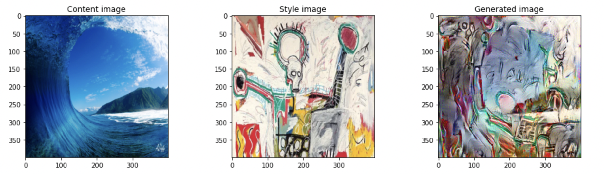

# Enhancing Phishing Detection with Neural Style Transfer

## Executive Summary

- **Neural Style Transfer:** An algorithm that generates artistic images by merging the content of one image with the style of another.
- **Pretrained ConvNet:** Uses hidden layer activations from a pretrained ConvNet to compute content and style cost functions.
- **Optimization:** Optimizes the total cost function to synthesize new images, updating pixel values instead of model parameters.
- **Cybersecurity Applications:** Enhances phishing detection, image authentication, forensic analysis, and advanced obfuscation techniques, showcasing its practical relevance in cybersecurity.

By integrating NST into cybersecurity data science, we can develop more robust and versatile models that improve the detection, analysis, and prevention of cyber threats.

*Figure 1: Detecting Phishing Websites with Neural Style Transfer - This image shows an exagerated visual representation of a legitimate website credit card form being altered by a hactivist meme and the resulting suspicious phishing website. The cybersecurity goal in this context is to identify phishing websites pretending to be legitimate websites but with subtly different style.*

*Figure 2: Surf Art Stenography - This image shows an exagerated visual representaqtion of a cybercriminal concealing sensitive infromation (Basquiat Painting) inside a surf image. The cybersecurity goal in this context would be to identify sensitive information such as malware or encryption keys that a threat actor subtly hid within the image to avoid detection.*

## Table of Contents
1. [Introduction](#1-introduction)
   - [1.1 Definition of Bias in Cybersecurity](#11-definition-of-bias-in-cybersecurity)
   - [1.2 Importance of Addressing Bias](#12-importance-of-addressing-bias)
2. [Why Bias is Important to Cybersecurity](#2-why-bias-is-important-to-cybersecurity)
   - [2.1 Impact on Threat Detection](#21-impact-on-threat-detection)
   - [2.2 Resource Allocation and Efficiency](#22-resource-allocation-and-efficiency)
   - [2.3 User Trust and Organizational Reputation](#23-user-trust-and-organizational-reputation)
3. [Why Bias is Important to Cybersecurity Data Science](#3-why-bias-is-important-to-cybersecurity-data-science)
   - [3.1 Role of Data Scientists in Cybersecurity](#31-role-of-data-scientists-in-cybersecurity)
   - [3.2 Consequences of Biased Data and Models](#32-consequences-of-biased-data-and-models)
   - [3.3 Ethical and Regulatory Compliance](#33-ethical-and-regulatory-compliance)
4. [Summary of Project Accomplishments](#4-summary-of-project-accomplishments)
   - [4.1 Explanation of Word Embeddings](#41-explanation-of-word-embeddings)
   - [4.2 Loading Pre-trained Word Vectors](#42-loading-pre-trained-word-vectors)
   - [4.3 Measuring Similarity Between Word Vectors](#43-measuring-similarity-between-word-vectors)
   - [4.4 Solving Word Analogy Problems](#44-solving-word-analogy-problems)
   - [4.5 Reducing Surveillance / Privacy Bias](#45-optional-exercise-on-reducing-gender-bias)
5. [Conclusion](#5-conclusion)
   - [5.1 Summary of Key Points](#51-summary-of-key-points)
   - [5.2 Importance of Ongoing Efforts to Address Bias](#52-importance-of-ongoing-efforts-to-address-bias)
   - [5.3 Call to Action for Data Scientists and Cybersecurity Professionals](#53-call-to-action-for-data-scientists-and-cybersecurity-professionals)
6. [References](#6-references)

## 1. Introduction
Neural Style Transfer (NST) is a deep learning technique that merges the content of one image with the style of another. Initially popularized for creating artistic images, NST has practical applications beyond art. This document outlines the importance of NST in cybersecurity and in cybersecurity data science, and describes the accomplishments achieved in this project.

## 2. Why Neural Style Transfer is Important to Cybersecurity

### 2.1 Impact on Threat Detection
- **Visual Content Analysis:** Phishing attacks often involve spoofed websites that mimic legitimate ones. NST can help analyze and detect visual similarities or discrepancies between legitimate and phishing websites based on their styles. By identifying inconsistencies in visual elements (like logos, layouts, and color schemes), NST can contribute to more effective phishing detection algorithms.

### 2.2 Resource Allocation and Efficiency
- **Forensic Analysis:** In forensic investigations, NST can assist in verifying the authenticity of images by analyzing their style consistency with known sources. It helps in identifying forged or altered images by comparing their styles with genuine reference images or databases.
- **Visual Pattern Recognition:** NST can aid in pattern recognition tasks related to forensic analysis, such as identifying recurring visual elements across crime scene photos or surveillance footage.

### 2.3 User Trust and Organizational Reputation
- **Advanced Obfuscation Techniques:** NST can blend sensitive information or patterns into innocuous images. By applying the style of a benign image to a sensitive one, NST makes it harder for unauthorized users or algorithms to detect hidden content.
- **Steganography:** NST can embed messages or data into images by transferring the style of one image (containing the message) onto another (a seemingly harmless image). This technique allows for covert communication and data hiding within visual content.
  
## 3. Why Neural Style Transfer is Important to Cybersecurity Data Science

### 3.1 Role of Data Scientists in Cybersecurity
- **Enhancing Data Analysis:** NST can help data scientists extract meaningful features from images that are crucial for training machine learning models in cybersecurity applications.
- **Anomaly Detection:** By transforming images using NST, data scientists can highlight anomalies that may not be easily visible in the original image, aiding in the detection of unusual patterns or activities.

### 3.2 Consequences of Biased Data and Models
- **Improving Model Performance:** NST can generate additional training data by creating stylistically varied versions of existing images, improving the robustness and generalizability of machine learning models.
- **Cross-Domain Learning:** NST enables models trained on one type of visual data to be adapted to another domain by transferring the style, thus facilitating cross-domain learning and improving the versatility of cybersecurity models.

## 4. Summary of Project Accomplishments

### 4.1 Explanation of Word Embeddings
- **Algorithm Implementation:** Successfully implemented the neural style transfer algorithm as described by Gatys et al. (2015), optimizing cost functions to get pixel values rather than model parameters.
- **Generating Artistic Images:** Used NST to generate novel artistic images by combining the content of one image with the style of another, demonstrating the algorithm's capabilities.

### 4.2 Loading Pre-trained Word Vectors
- **Content Cost Function:** Defined the content cost function using the activations of a hidden layer in a pretrained convolutional neural network (ConvNet).
- **Style Cost Function:** Defined the style cost function using the Gram matrix of the activations of multiple hidden layers in a ConvNet.

## 5. Conclusion

Neural Style Transfer enhances cybersecurity practices by leveraging its ability to manipulate and analyze visual content. It provides tools for both defending against threats through obfuscation and detection techniques and in conducting detailed forensic examinations of digital imagery. These applications highlight NST's versatility beyond its original artistic purposes, demonstrating its potential impact in enhancing digital security measures.

### 5.1 Summary of Key Points

### 5.2 Importance of Ongoing Efforts to Address Bias

### 5.3 Call to Action for Data Scientists and Cybersecurity Professionals

## 6. References

- **Academic Papers and Articles**:
  - [Leon A. Gatys, Alexander S. Ecker, Matthias Bethge, (2015). A Neural Algorithm of Artistic Style](https://arxiv.org/abs/1508.06576)
  - [Harish Narayanan, Convolutional neural networks for artistic style transfer.](https://harishnarayanan.org/writing/artistic-style-transfer/)
  - [Log0, TensorFlow Implementation of "A Neural Algorithm of Artistic Style".](https://www.chioka.in/tensorflow-implementation-neural-algorithm-of-artistic-style)
  - [Karen Simonyan and Andrew Zisserman (2015). Very deep convolutional networks for large-scale image recognition
MatConvNet.
](https://arxiv.org/pdf/1409.1556)
- **Courses**:
  - [Ng, A., Katanforoosh, K., & Mourri, Y. (n.d.). Convolutional Neural Networks. DeepLearning.AI, Coursera.](https://www.coursera.org/learn/convolutional-neural-networks)

